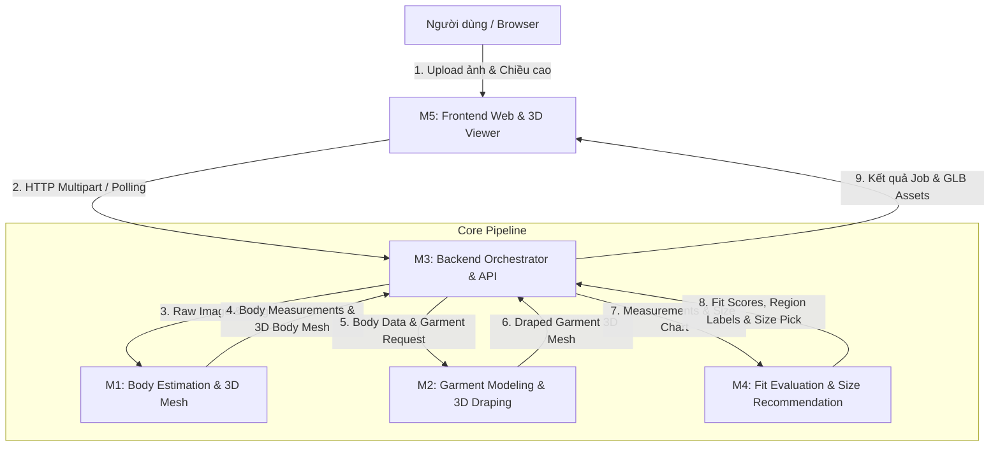

# TỔNG QUAN VÀ PHÂN TÍCH HỆ THỐNG VIRTUAL TRY-ON PLATFORM

**Tên dự án:** Virtual Try-On Platform  
**Trạng thái hiện tại:** Phase M3 Mock MVP (v0.1)  
**Tài liệu hợp đồng API:** [docs/api/api-contract.md](api/api-contract.md)  
**Tài liệu kiểm thử:** [docs/testing/test-strategy.md](testing/test-strategy.md)  
**CI/CD Pipeline:** [docs/ci-cd/pipeline.md](ci-cd/pipeline.md)  

---

## 1. Mục tiêu dự án (Project Objectives)

**Virtual Try-On Platform** là nền tảng thử trang phục 3D và khuyến nghị kích cỡ (size recommendation) cá nhân hóa.

Mục tiêu cốt lõi:
1. **Tái tạo số đo và hình thể 3D:** Tiếp nhận ảnh chụp người dùng và chiều cao thực tế để ước tính các số đo nhân trắc học chính (`chest_cm`, `waist_cm`, `hip_cm`, `shoulder_width_cm`) và dựng mô hình cơ thể 3D (Body Mesh).
2. **Mô phỏng mặc đồ 3D (3D Garment Draping):** Mô phỏng trang phục được chọn trên vóc dáng cơ thể 3D của người dùng theo từng kích cỡ (S, M, L, XL).
3. **Đánh giá độ vừa vặn & Khuyến nghị Size (Fit Evaluation & Size Recommendation):** Đánh giá mức độ vừa vặn từng phân vùng giải phẫu (`chest`, `waist`, `hip`, `shoulder`) với các nhãn định tính (`tight`, `good`, `loose`, `unknown`) và điểm số (`fit score`), từ đó khuyến nghị kích cỡ tối ưu nhất.
4. **Trực quan hóa tương tác 3D:** Cho phép người dùng quan sát trực tiếp mô hình cơ thể mặc trang phục dưới dạng 3D xoay 360 độ trên trình duyệt web.

---

## 2. Kiến trúc phân rã Module (Modules M1 – M5)

Hệ thống được chia thành 5 module nghiệp vụ độc lập, tương ứng với cấu trúc thư mục dự án:



### Chi tiết vai trò từng module:

| Module | Tên gọi | Thư mục | Trọng tâm công nghệ / Nhiệm vụ |
| :---: | :--- | :--- | :--- |
| **M1** | **Body & 3D Reconstruction** | `body/` | Phân tích ảnh 2D, nhận diện landmarks (MediaPipe), tối ưu hóa hoặc dự đoán mô hình tham số SMPL-X để trích xuất số đo và xuất file 3D Body GLB. |
| **M2** | **Garment & Cloth Draping** | `garment/` | Quản lý catalog trang phục, bảng số đo size chart chuẩn (`garment/size_chart/`), tạo 3D garment mesh và mô phỏng vật lý vải (Blender headless/Cloth simulation). |
| **M3** | **Core Backend & API** | `backend/` | Điều phối toàn bộ luồng nghiệp vụ (`TryOnOrchestrator`), quản lý vòng đời Job bất đồng bộ (`JobManager`), cung cấp REST API (FastAPI) và phục vụ static GLB assets an toàn. |
| **M4** | **Fit & AI Recommendation** | `fit/`, `ai/` | Thuật toán và mô hình AI đánh giá độ vừa theo 4 phân vùng (`chest`, `waist`, `hip`, `shoulder`), tính điểm `fit score` và gợi ý kích cỡ phù hợp nhất. |
| **M5** | **Frontend Web & 3D Viewer** | `frontend/` | Ứng dụng web React + TypeScript + Three.js / React Three Fiber. Cung cấp flow người dùng: Upload ảnh ➔ Chọn trang phục & size ➔ Xem kết quả 3D tương tác. |

---

## 3. Luồng dữ liệu nghiệp vụ (End-to-End Dataflow)

Quy trình người dùng trải nghiệm được thiết kế theo luồng bất đồng bộ:

```
[BƯỚC 1: ANALYZE]
Frontend (M5) ──── POST /api/tryon/analyze ────► Backend (M3)
(Ảnh JPG/PNG + height_cm)                          │
                                                   ├─ Validate định dạng, bytes, pixels
                                                   ├─ Gọi M1 tạo Body (Measurements + Mesh)
                                                   └─ Trả 200: body_id, số đo, asset url

[BƯỚC 2: FIT REQUEST]
Frontend (M5) ──── POST /api/tryon/fit ────────► Backend (M3)
(body_id + garment_id + size)                      │
                                                   ├─ Validate body_id, garment_id, size hợp lệ
                                                   ├─ Tạo Job trạng thái "pending"
                                                   ├─ Đưa vào BackgroundTasks xử lý
                                                   └─ Trả 202 Accepted: job_id

[BƯỚC 3: ASYNC PROCESSING & POLLING]
Backend BackgroundTasks:
  pending ──► running ──► Gọi M2 (Draping) + Gọi M4 (Fit/Recommendation) ──► completed | failed

Frontend (M5) ──── GET /api/jobs/{job_id} ─────► Polling định kỳ cho đến khi xong
                                                   └─ Trả 200: status ("completed"), kèm FitResult

[BƯỚC 4: RENDER 3D & KẾT QUẢ]
Frontend (M5) ──── GET /api/assets/{name}.glb ─► Tải binary 3D mesh và render lên Canvas 3D
```

---

## 4. Hiện trạng thực tế của Repo (Phase M3 Mock MVP v0.1)

Dự án hiện đã hoàn tất mốc **M3 Backend Mock MVP**, đóng vai trò là "bộ khung xương" (scaffolding & contract) chuẩn mực để các nhóm triển khai độc lập mà không bị phụ thuộc lẫn nhau.

### 4.1. Những gì đã hoàn thành (Ready & Production-like in Architecture)

1. **Hệ thống API Contract chặt chẽ ([docs/api/api-contract.md](api/api-contract.md)):**
   * Định nghĩa toàn diện cấu trúc request/response, mã lỗi HTTP và logic nghiệp vụ.
   * Tất cả response (trừ `/health` và binary GLB) dùng chung wire envelope:
     ```json
     { "data": <T | null>, "error": <ApiError | null> }
     ```
2. **Quy chuẩn tọa độ 3D Mesh bắt buộc:**
   * Định dạng file: **GLB 2.0 (binary glTF)**.
   * Đơn vị: **Mét** (quy đổi từ cm bằng cách chia cho 100 đúng một lần).
   * Hệ tọa độ: **Tay phải (Right-handed)**, **+Y hướng lên**, **+Z hướng ra trước ngực**, **+X hướng sang trái giải phẫu**.
   * Gốc tọa độ: Điểm giữa 2 bàn chân trên mặt sàn (**Y=0**).
   * Tư thế chuẩn: **T-pose** (đứng thẳng, chân song song, tay dang ngang).
3. **Cơ chế Typed Seam / Provider Pattern ([backend/services/orchestrator.py](../backend/services/orchestrator.py)):**
   * Backend xây dựng ranh giới rõ ràng thông qua `TryOnProvider` protocol:
     * `garments() -> list[GarmentSchema]`
     * `analyze(image: bytes, height_cm: float) -> BodySchema`
     * `fit(body, garment, request) -> FitResultSchema`
   * Hiện tại, hệ thống sử dụng `MockProvider` để trả dữ liệu giả lập. Khi M1, M2, M4 hoàn thiện, chỉ cần cắm Adapter thật vào seam này mà không phải sửa đổi API router hay logic bảo mật.
4. **Bảo mật và Validation nghiêm ngặt:**
   * Dùng thư viện `Pillow` để giải mã và kiểm tra ảnh nhị phân thực tế; ngăn chặn giả mạo extension hoặc Content-Type.
   * Chống tấn công `Decompression Bomb` (Pixel Flood attack), giới hạn tối đa 5 MiB và 16 triệu pixels.
   * Chống tấn công `Directory Traversal` (chặn truy cập file tùy ý ngoài thư mục asset cho phép).
5. **Hạ tầng kiểm thử & CI:**
   * Đạt 51/51 bài test unit và e2e mock pass trên Python 3.10.
   * Frontend đã bổ sung `tsconfig.json`, `index.html`, `main.tsx` và thực hiện `npm run build` (tsc + Vite bundle) thành công 100%.

### 4.2. Những gì đang là Mock / Skeleton (Chưa triển khai logic thật)

* **AI Inference (M1 & M4):** Chưa nạp weights model thật (MediaPipe, SMPL-X). Số đo trả về hiện là số cố định (`source: "mock"`), `confidence` và `score` luôn là `null`.
* **Mô phỏng vải 3D (M2):** Chưa tích hợp Blender headless script hay cloth physics. Các file GLB hiện tại là các hình khối hộp ghép dạng người T-pose (`box_geometry_fixture`) được sinh từ script [scripts/generate_mock_glb.py](../scripts/generate_mock_glb.py).
* **Lưu trữ & Queue (M3):** Hiện tại hoàn toàn lưu trên bộ nhớ RAM process-local (`dict`). Khi khởi động lại server, toàn bộ `body_id` và `job_id` sẽ mất; chưa có Database bền vững (PostgreSQL) hay Distributed Queue (Celery/Redis).
* **Giao diện người dùng (M5):** Mới chỉ dừng lại ở trang placeholder `UploadPage` cơ bản, chưa có giao diện 3D Canvas và các trang chọn size/kết quả tương tác hoàn chỉnh.

---

## 5. Các nguyên tắc thiết kế quan trọng (Design Principles)

1. **Minh bạch nguồn gốc dữ liệu (Data Provenance):**
   * Mọi đối tượng dữ liệu trong hệ thống đều mang 3 trường: `source` (`"mock"` | `"module"` | `"mixed"`), `method` (chuỗi mô tả giải thuật) và `notes` (ghi chú ngữ cảnh).
   * Điều này ngăn ngừa việc nhầm lẫn dữ liệu thử nghiệm giả lập với kết quả đo đạc thực tế của AI.
2. **Khả năng quan sát tiến trình (Job Lifecycle Visibility):**
   * Tác vụ fitting có thể tốn từ vài giây đến hàng chục giây khi có AI/Blender. Việc dùng trạng thái `pending -> running -> completed | failed` giúp UI cập nhật trạng thái rõ ràng, không làm nghẽn kết nối HTTP.
3. **Phân tách môi trường CI & Local:**
   * CI không cài PyTorch, MediaPipe, Blender hoặc GPU drivers nặng để đảm bảo tốc độ chạy dưới 2 phút.
   * Kiểm thử nặng được phân loại bằng pytest markers (`slow`, `gpu`) và chạy cục bộ, lưu kết quả bằng chứng (evidence log).

---

## 6. Lộ trình triển khai tiếp theo (Next Steps / Roadmap)

| Module | Trách nhiệm chính | Ưu tiên kế tiếp |
| :---: | :--- | :--- |
| **M1** | Body Estimation | 1. Tích hợp MediaPipe Pose trích xuất các điểm khớp 2D/3D.<br>2. Ước lượng số đo cơ thể (`chest`, `waist`, `hip`, `shoulder`) dựa trên chiều cao người dùng.<br>3. Tạo adapter xuất 3D Body Mesh chuẩn hệ trục GLB. |
| **M2** | Garment & 3D | 1. Xây dựng catalog áo thật và chuẩn hóa file JSON size chart.<br>2. Thiết lập script Blender headless tự động draping áo lên body mesh.<br>3. Xuất file `tryon_mesh.glb` tối ưu hóa polygon/texture cho web. |
| **M4** | Fit & AI | 1. Xây dựng thuật toán so sánh số đo cơ thể với bảng size của áo.<br>2. Phân loại độ vừa vặn từng vùng (`tight`, `good`, `loose`).<br>3. Tính điểm Fit Score tổng quan và đưa ra đề xuất size mua hàng. |
| **M5** | Frontend | 1. Xây dựng 3D Canvas bằng `@react-three/fiber` và `@react-three/drei`.<br>2. Hoàn thiện luồng: Upload ➔ Loading/Polling ➔ Xem kết quả 3D tương tác xoay/phóng to.<br>3. Hiển thị bảng số đo và badge đánh giá độ vừa trực quan. |
| **M3 / DevOps** | Backend & Infra | 1. Giữ vững API contract làm cầu nối cho các module.<br>2. Chuyển đổi In-memory Store sang Redis/Database khi tích hợp tải thật.<br>3. Tích hợp Docker Compose cho môi trường dev hoàn chỉnh. |
